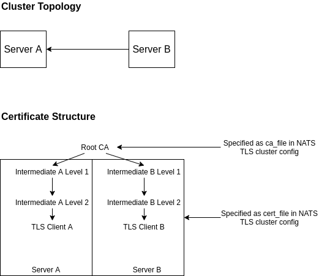

This project showcases how to setup a NATS Server Cluster with mutual TLS authentication.
Although this is explained in the NATS documentation, the cluster in this project assumes
that each node has a certificate under their own branch under the shared root CA: 



The main.go application is used to generate the certificate structure and keys.

### Starting
To start server A and server B:
```
nats-server -config nats/server1.txt &
nats-server -config nats/server2.txt &
```